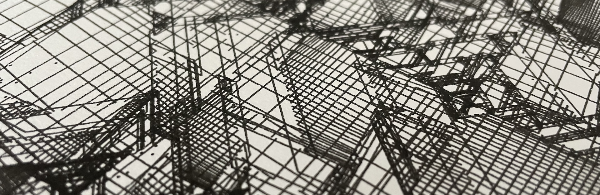
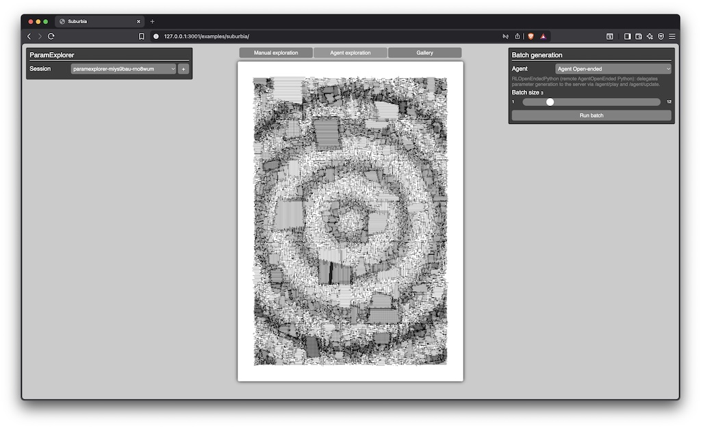
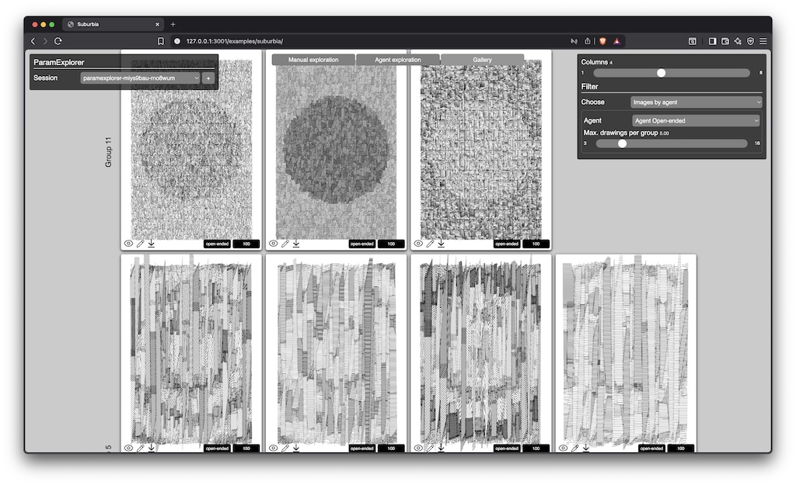

# ParamExplorer

Authors: [Julien Gachadoat](https://www.v3ga.net/) and [Guillaume Lagarde](https://guillaume-lagarde.github.io/).

A companion paper is available [here](https://arxiv.org/abs/2512.16529).

## About ParamExplorer
Generative art systems often involve high-dimensional and complex parameter spaces in which aesthetically compelling outputs occupy only small, fragmented regions. Because of this combinatorial explosion, artists typically rely on extensive manual trial-and-error, leaving many potentially interesting configurations undiscovered.

We introduce *ParamExplorer*, an interactive and modular framework inspired by reinforcement learning that helps the exploration of parameter spaces in generative art algorithms, guided by human-in-the-loop or even automated feedback.



### Requirements
*ParamExplorer* requires Python installed on your computer and a web browser to run the tool. 

### Installation
*ParamExplorer* is built around two components : 
* A client interface that is built with HTML / CSS / JavasScript using [p5js](https://p5js.org/) and a custom UI library.
* A python server that takes requests from the client for various tasks : 
  * serving webpage for the client interface.
  * computing parameters for your algorithm using various strategies in the field of reinforcement learning.

You can clone or directly download a zipped folder of the project.

### Server installation
First we are going to create a virtual environment for the server.
In a terminal type the following commands : 
```bash
# Replace [path] with the appropriate location on your system
cd [path]/param-explorer 
```
```bash
python -m venv .venv
```

Then activate the virtual environment : 

**MacOS / Linux**
```bash
source .venv/bin/activate
```
**Windows**
```bash
.\.venv\Scripts\Activate.ps1
```

Once the virtual environment is activated, install the project’s dependencies listed in the ```requirements.txt``` file: 
```bash
pip install -r requirements.txt
```
That's it ! You should be able to run the server now.

### Server lauching
```bash
python ./server.py
```
If everything went fine, you should be able to open ```http://127.0.0.1:3001``` on your browser and navigate into the examples.


### Integrating your own algorithm
The first step is to duplicate the ```examples/__template__```folder, that contains only two files ```ìndex.html``` and ```sketch.js``` in a typical *p5js* file architecture.

```sketch.js``` is the main script that contains one variable to change and a few mandatory functions to be implemented. 

#### User sketch id
First of all, you have to change the value ```USER_SKETCH_ID``` variable that will be used by *ParamExplorer* to save some informations on client side through [localStorage](https://developer.mozilla.org/en-US/docs/Web/API/Window/localStorage) API of the browser. 

```js
const USER_SKETCH_ID = 'your_project_id';
```

#### Setup and draw
The *ParamExplorer* framework is going to call ```setupArtwork()``` and ```drawArtwork()``` functions each time it generates a new set of parameters. This is where you are going to put the logic that is usually set in the ```setup()```and ```draw()``` functions.

```js
  // if newSeed if set to true, user has to generate a new seed
  function setupArtwork(newSeed=false)
  {
    if (!p5RandomSeed || newSeed)
      p5RandomSeed = int(Math.random(100000));
    randomSeed(p5RandomSeed);
  }

  // sketch is an instance of p5
  function drawArtwork(sketch)
  {
    sketch.background("#000");
    // ...
  }
```

#### Declaring parameters
Once this is done, you will have to implement the variables you want to expose in the ```paramExplorer``` instance declared in the ```setup()``` function. For the moment *ParamExplorer* handles three parameters types : ```float```, ```ìnteger``` and ```choice```.

Each parameter should be declared with some additional properties : 

* ```float```, ```integer```
  * ```range``` is an ```Array``` describing the minimum and maximum values the parameter can take.
  * ```obj``` is optionnal and refers to the object holding the variable. If not set, it will be default to [globalThis](https://developer.mozilla.org/en-US/docs/Web/JavaScript/Reference/Global_Objects/globalThis). 
* ```choice```
  * ```choices``` is an ```Array``` of integers holding possible values for the parameter, typically an enumeration.
  * ```obj``` *(optionnal)* refers to the object holding the variable. If not set, it will be default to [globalThis](https://developer.mozilla.org/en-US/docs/Web/JavaScript/Reference/Global_Objects/globalThis). 
  * ```labels``` *(optionnal)* is an ```Object```of key-values holding the labels for the integer values of ```choices```.   

Let's say your algorithm has a global float variable named ```diameter``` that drives a key feature of your visuals. You can declare a parameter like this :  

```js
  paramExplorer = (new ParamExplorer(USER_SKETCH_ID))
  .setParameters({

    'diameter'   : {'type' : 'float',    'range' : [100,200],       'obj' : globalThis}

}).finalize();
```

It's very important that the key of the object given to ```setParameters()``` function match the name of your variable. 


#### Saving and loading sketch data
It is possible to recall a drawing from the gallery for editing it. Thus, you have to save some data that allowed the generation of a particular drawing, especially the seed for initializing the sequence of random numbers. Other useful data can be saved in the object returned to the *ParamExplorer* framework.

```js
  // Returns the current seed 
  function getArtworkData()
  {
    return {'p5RandomSeed' : p5RandomSeed};
  }

  // Sets the current seed 
  // before setupArtwork() & drawArtwork() are called
  // Useful for editing a drawing from the gallery
  function setArtworkData(data={})
  {
    if ('p5RandomSeed' in data)
      p5RandomSeed = data['p5RandomSeed'];
  }
```

## Using the tool

### Session identifier
A session identifier helps the *ParamExplorer* framework to keep track of your experimentations. For a given sketch, it is possible to handle multiples sessions to explore the parameters space differently. 

### Manual Exploration
This tab exposes an interface that was automatically generated from the parameters definition.<br />
The ```Generate``` button allows you to create a new drawing after having randomly sampled the parameters values in their respective range.<br />
Once generated, you can attribute a score between 0 and 100 to the drawing to make the framework 'learn' about what you estimate to be a nice drawing.


### Agent exploration
This tab is the heart of the *ParamExplorer* framework. It allows to generate multiple images according to different computational strategies embedded in the *agents*.<br />An agent is an entity that tries to optimize and discover new sets of parameters depending on what it has been learning thanks to scores users gave to previous images.<br /> The tool proposes four agents for the moment : 
* ```Agent Random``` samples randomly in the parameters space, same strategy as in manual exploration.
* ```Agent CMA-ES``` learns how parameters influence each other, number of visual groups is fixed for the moment in the code ( ```n_agents``` in ```agent_cmaes.py``` on backend ).
* ```Agent Gaussian``` improves visuals by making slight variations around previously liked images, adjusting each parameter independently, the number of clusters (groups) is also fixed (```population_size``` in ```agent_gaussian.py``` in the backend).
* ```Agent Open-ended``` similar in spirit to Agent Gaussian but can continuously create new clusters (groups) over time with no fixed limit.

Each time a batch is generated, the images and their parameters are saved in the gallery where you can set a score or delete them to train the agents.



### Gallery
A grid of images is displayed according to different filters.<br />If the filter ```Images by agent``` is selected, images that were generated by that agent are grouped into clusters with some "parameters similarity" (except of the ```Agent Random```)<br />
You can select an image by clicking on it. Selecting multiple images id done by pressing ```Command```(MacOS) or ```Control```(Windows / Linux) while clicking on images.
Several "hot keys" were defined to help setting score or deleting groups of images quickly : 
  * ```'a'``` selects all the images.
  * ```'d'``` deletes the selected images with a prior validation popup.
  * ```'s'``` sets the score to 100 to the selected images.


## In practice
1. You may want to explore manually the set of parameters for your algorithm : 
  * either in the ```Manual Exploration``` tab by clicking on the ```Generate``` button.
  * either in the ```Agent Exploration``` tab by running batches with the ```Agent Random```.
2. In the ```Gallery``` tab, give score to the generated images you like, around 30~40 images is a good starting point to train agents.
3. In the ```Agent Exploration``` tab, start generating images using an agent (except the ```Agent Random```). The *ParamExplorer* framework should start creating images with learnt parameters but also should try to find new directions in this parameters space to propose new series of drawings ... and surprises you !
4. If you find some new drawings not seen before, you can edit the sets of parameters in ```Manual Exploration``` in step 1. so agents can learn from this point in parameters space and explores further in this direction. 

